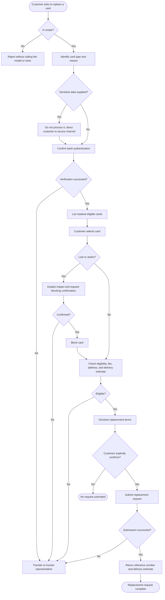

# Agent Workflow

This document describes the card replacement agent's conversational workflow as
implemented in `agent.py`, `tools/card_replacement.py`, and `guardrails.py`.
For system architecture and component boundaries, see [ARCHITECTURE.md](ARCHITECTURE.md).

The agent handles **debit and credit card replacement only**. Supported reasons
are lost, stolen, damaged, expired, and not received. The language model guides
the conversation; every sensitive banking action is enforced by backend tools.

## Workflow overview

## Step-by-step workflow

### Step 1: Scope check

Before the model runs (Streamlit UI only), `guardrails.py` checks whether the
customer's message is related to card replacement. Unrelated questions receive a
fixed out-of-scope response and never reach the model or banking tools.

The agent system prompt also limits scope: if a customer asks about geography,
general knowledge, or another banking service, the agent declines politely and
does not call tools.

### Step 2: Identify reason and card type

The agent determines:

- **Why** the customer needs a replacement: lost, stolen, damaged, expired, or
  not received.
- **Which kind of card**: debit or credit.

The agent must not invent customer IDs, card IDs, or verification references.

### Step 3: Authentication

Authentication happens **outside the chat**. The agent must not collect
passwords, PINs, CVVs, full card numbers, security answers, or one-time
passcodes.

In this demo, the `authenticate_customer` tool confirms that the customer
completed secure verification by accepting:

- a ten-digit **customer ID** (e.g. `1000000001`)
- a **verification session reference** beginning with `verified-` (e.g.
  `verified-1000000001`)

If verification fails, the agent calls `transfer_to_human`.

In production, replace this with the bank's existing authenticated session —
never have the model perform authentication itself.

### Step 4: List masked cards

After authentication, the agent calls `list_customer_cards` to show eligible
cards using **masked details only** (card type, network, last four digits,
status). The customer selects the card to replace.

### Step 5: Block lost or stolen cards

For **lost** or **stolen** cards only:

1. The agent explains that blocking prevents further use.
2. The agent obtains **explicit confirmation** from the customer.
3. The agent calls `block_card`.
4. Only after a successful block does the flow continue to eligibility.

For damaged, expired, or not-received cards, skip blocking and proceed directly
to eligibility.

### Step 6: Check eligibility and disclose terms

The agent calls `check_replacement_eligibility` and clearly states:

- whether the card is eligible
- replacement fee
- delivery address
- estimated delivery time

If the card is not eligible, the agent calls `transfer_to_human`.

### Step 7: Confirm and submit replacement

The agent obtains **explicit customer confirmation** after disclosing all
terms, then calls `submit_replacement_request` with `customer_confirmed=True`.

The agent must not claim a replacement was submitted unless the tool reports
success. On success, the agent returns:

- a replacement **request reference** (e.g. `CR-A1B2C3D4`)
- the **estimated delivery date**

### Step 8: Human handoff

The agent calls `transfer_to_human` when:

- authentication or verification fails
- fraud is suspected
- a transaction is disputed
- the request is outside policy or unclear
- blocking or submission fails
- the customer declines blocking or replacement after terms are shown

## Tools

| Tool | Purpose |
| --- | --- |
| `authenticate_customer` | Confirms a completed secure-verification session |
| `list_customer_cards` | Returns eligible cards with masked details only |
| `block_card` | Blocks a lost or stolen card after explicit confirmation |
| `check_replacement_eligibility` | Returns eligibility, fee, address, and delivery estimate |
| `submit_replacement_request` | Submits a confirmed replacement request |
| `transfer_to_human` | Escalates exceptions to a bank representative |

Each action tool re-checks authentication server-side. The model cannot bypass
tool-layer authorization.

## Security rules

- Never ask for or accept a full card number, CVV, PIN, password, security
  answer, or one-time passcode.
- Use only masked card details returned by tools to identify a card.
- Never claim a card is blocked or a replacement is submitted unless the
  matching tool reports success.
- Never invent tool inputs (customer ID, card ID, verification reference).
- All card actions are logged to the demo audit trail in SQLite.

## Demo credentials

For the mock flow in this repository:

- Customer ID: `1000000001`
- Verification session: `verified-1000000001`

The dataset contains 500 fictional customers in `data/mock_customers.json`, each
with one debit and one credit card.

## Related documentation

- [README.md](README.md) — setup, run instructions, and project overview
- [ARCHITECTURE.md](ARCHITECTURE.md) — system architecture and responsibility boundaries
- [OLLAMA_INTEGRATION.md](OLLAMA_INTEGRATION.md) — local model configuration and request lifecycle
